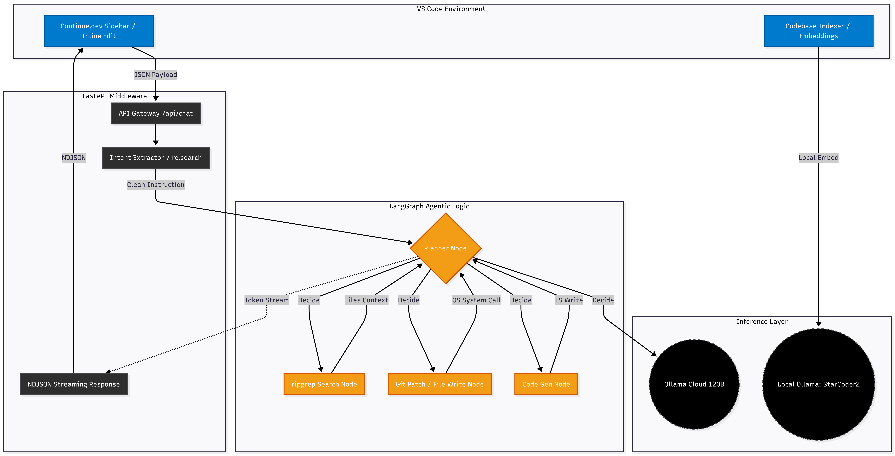
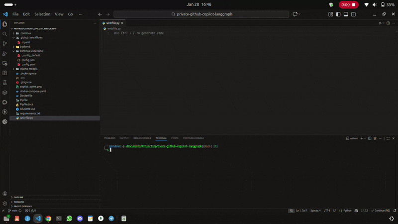

# 🤖 Private GitHub Copilot: Agentic LangGraph Bridge

A stateful, high-intelligence local-to-cloud bridge for VS Code. This project integrates **Continue.dev** with a **LangGraph-powered agent** running on Ollama Cloud (120B). Unlike standard Copilot, this agent can autonomously search your repository using `ripgrep` and apply code changes directly to your filesystem via git patches.

---

## 🏗️ Architecture Data Flow Diagram


### Quick Preview (GIF)



## 🌟 Key Features

* **Intent Extraction:** Automatically strips VS Code internal boilerplate to focus the agent on your specific instructions.
* **Stateful Multi-Turn Logic:** Built on LangGraph, allowing the agent to "think" before acting.
* **Deep Context Retrieval:** Integrated `ripgrep` node for high-speed repository-wide code searches.
* **Autonomous Writing:** Can generate and apply git patches or create new files directly from chat.
* **Hybrid Intelligence:** Uses **Ollama Cloud 120B** for complex reasoning and **Local StarCoder2** for low-latency autocomplete.

---

## 🚀 Quick Start

### 1. Prerequisites

* Ollama installed locally.
* [Continue.dev](https://continue.dev) VS Code Extension.
* `OLLAMA_API_KEY` from your Ollama Cloud account.

### 2. Backend Setup

```bash
# Clone the repository
git clone https://github.com/your-repo/private-copilot
cd private-copilot

# Install dependencies via Pipenv
pipenv install

# Export your Cloud Key
export OLLAMA_API_KEY="your_key_here"

# Start the Agentic Bridge
pipenv run uvicorn backend.main:app --host 0.0.0.0 --port 8000 --reload

```

### 3. VS Code Configuration

Open your Continue `config.yaml` and apply the following schema:

```yaml
name: Ollama Cloud Agent
version: 1.0.0
schema: v1

models:
  - name: Agent 120B (Ollama Cloud)
    provider: ollama
    model: gpt-oss:120b-cloud
    apiBase: http://localhost:8000
    roles: [chat, edit, apply]

tabAutocompleteModel:
  name: StarCoder2
  provider: ollama
  model: starcoder2:15b
  apiBase: http://localhost:11434

```

---

## 🛠️ Internal Node Logic

| Node | Purpose | Tool Used |
| --- | --- | --- |
| **Planner** | High-level decision making (Search vs Patch vs Answer). | LLM Reasoning |
| **Search** | Finds specific code implementation patterns across the repo. | `ripgrep (rg)` |
| **Patch** | Modifies existing code without manual copy-pasting. | `git apply` |
| **Generate** | Scaffolds new functions or modules based on requirements. | `fs.write` |

---

## 🛡️ Privacy & Security

* **Embeddings:** Code indexing stays 100% local via `nomic-embed-text`.
* **Inference:** Only specific queries and retrieved code snippets are sent to Ollama Cloud over encrypted TLS.

> **Ready to start?** Run the backend and type `/fix add module documentation` in your VS Code sidebar to see the agent in action!

---

Would you like me to help you refine the `config.yaml` or create a `docker-compose.yml` for this setup?